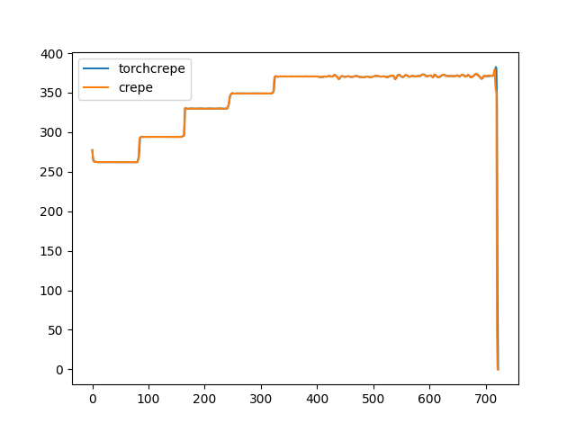
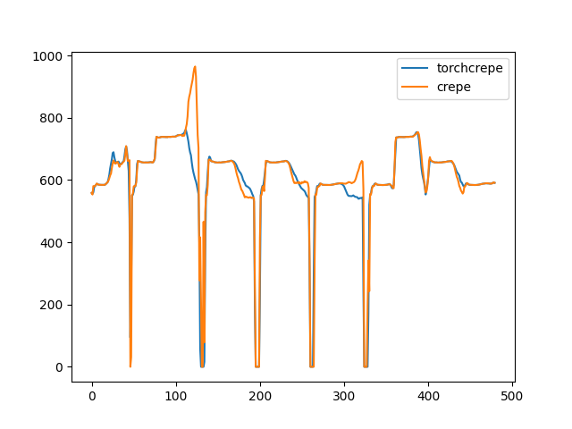

## TorchCrepeV2

My own version of [crepe](https://github.com/marl/crepe) in PyTorch, SOTA pitch tracking tool. Releasing as pip package for ease of usage.

Only `full` version of model is supported.

Similar project: https://github.com/maxrmorrison/torchcrepe

## Usage

`pip install git+https://github.com/gudgud96/torchcrepeV2`

```python
from torchcrepeV2 import TorchCrepePredictor
import numpy as np
import matplotlib.pyplot as plt

y, sr = librosa.load("some_audio.wav", sr=16000)
torch_crepe = TorchCrepePredictor(device="cuda")

# all arguments are aligned with original crepe implementation
f = torch_crepe.predict(y=y, 
                        sr=sr,
                        viterbi=True, 
                        center=True, 
                        step_size=10)

# can add some post-processing
block_size = 100
length = y.shape[0] // 100
if f.shape[-1] != length:
    f = np.interp(
        np.linspace(0, 1, length, endpoint=False),
        np.linspace(0, 1, f.shape[-1], endpoint=False),
        f,
    )

plt.plot(f, label='torchcrepe')
plt.show()
```

## Results

Tracked pitch nearly identical as compared to `crepe`.





## TODO
- [ ] Optimize inference performance
